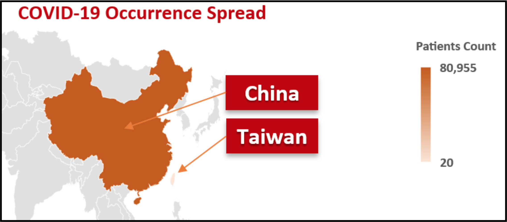
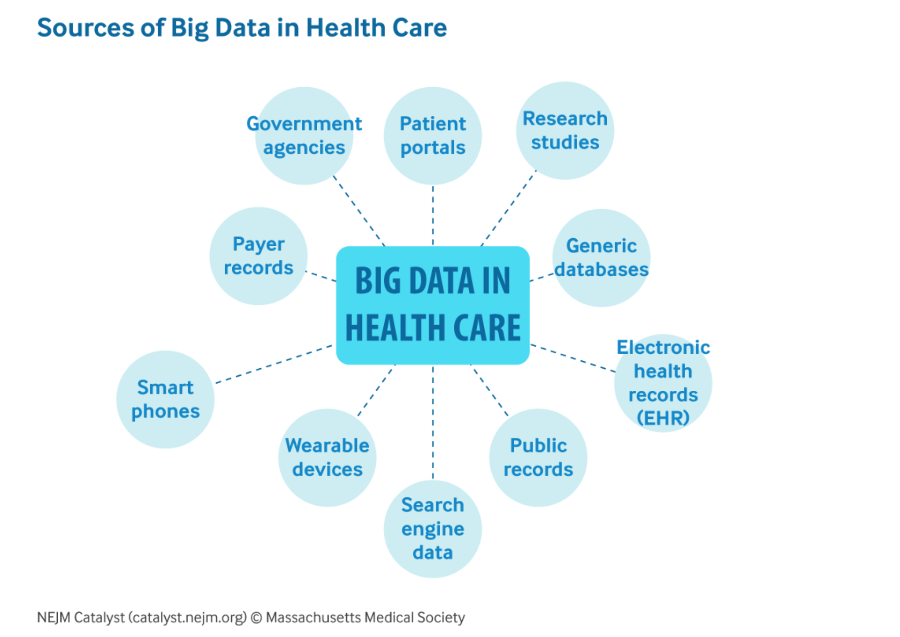
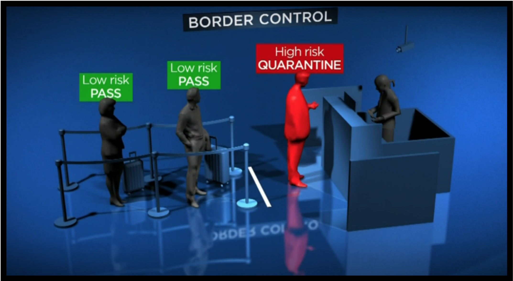

ماذا لو كان أعداد المصابين بفيروس كرورنا COVID-19 أقل بكثير مما كان متوقع (وهو ما يُشار إليه بعلم تحليل البيانات بالتنبؤ السلبي)؟

دعونا في المقال هذه نسلط الضوء على تنبؤ سلبي مماثل حَصَل في مدينة تايوان.

أعداد المرضى المصابين بـ COVID-19 في تايوان أقل بكثير مما كان يتوقعه المحللون، حيث لم تتجاوز عدد الحالات 50 مصاب تم اكتشافهم خلال الفترة الماضية. 
ما هو السبب الذي جعل تايوان من أقل الدول في أعداد المصابين؟

السبب يكمن في استخدام علم البيانات وبالتحديد الذكاء الاصطناعي Artificial Intelligence والبيانات الضخمة Big Data ، استعانت الحكومة التايوانية بشركة BlueDot المختصة بالمجال، وقامت الشركة بدورها بإنشاء نظام تعقب عن طريق مراقبة تحركات أكثر 400 مليون مستخدم عن طريق الهاتف المحمول

السبب المطروح ينتج عنه تساؤل آخر، كيف ممكن لبيانات التعقَب حدّ انتشار المرض ومعدلات انتقال العدوى ؟
الجواب يكمن في ربط بيانات التأمينات الصحية للمواطنين والمقيمين مع بيانات الجمارك. 

نتجت عن ربط الجهتين قاعدة بيانات كبيرة ، والتي قامت باستخدامها شركة BlueDot لتقديم تحليل دقيق عن إمكانيّة إصابة أي فرد بالمرض عن طريق دراسة تاريخ ترحاله بين الدول المصابة.

نظام التعقب يراقب الزوار القادمين من خارج تايوان. وفي حال وجود اعراض مشابه لأعراض COVID-19 يتم تحليل الزائر او وضعه في الحجر الصحي اذا كان الزائر قادم من دولة منتشر فيها الفيروس.

أخيرا، استخدام البيانات في قطاع الرعاية الصحيّة واسع جدّا. تحليل البينات عن طريق تعلم الآلة ( ML – Machine Learning  ) أيضا من أهم الأدوات المستخدمة بالمجال.
عالم البيانات Igor Bobriakov @ibobriakov لديه عدة تطبيقات في توظيف علم البيانات في المجال المذكور، للاستزادة : [https://bit.ly/39NPdS6](https://bit.ly/39NPdS6)

### المصادر
Global News: @Globalnews & [https://bit.ly/2TZfBlv](https://bit.ly/2TZfBlv)
World Health Organization WHO : Situation Report - 51 Dated 11th March: [https://bit.ly/3aP0Ecr](https://bit.ly/3aP0Ecr)
