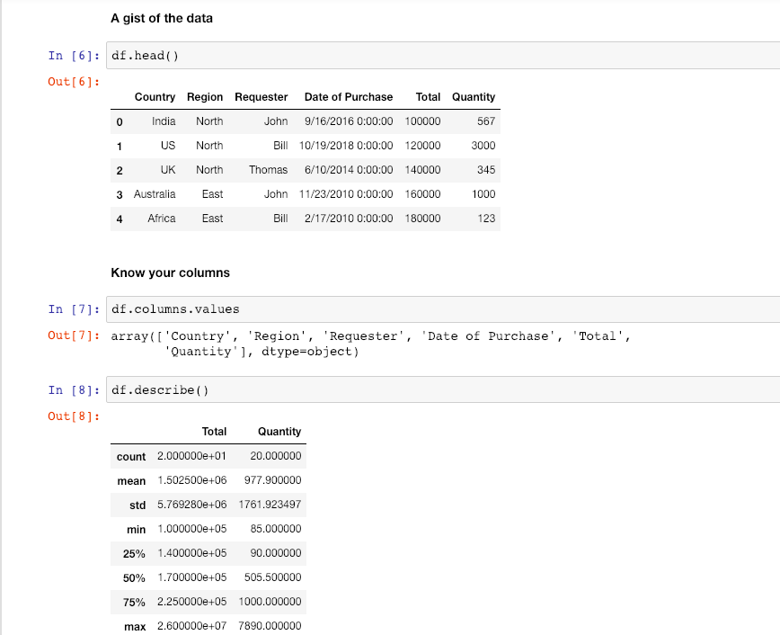
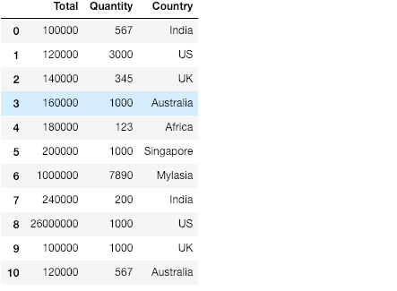
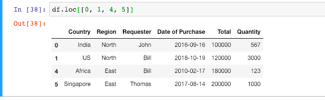
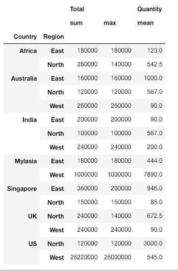

بداية وعند إستخدام أي مكتبة لتحليل البيانات ستحتاج لفهم بياناتك جيدًا، 
قبل الشروع في تمثيلها بيانيًا لإن هنالك اكثر من طريقة مختلفة للتمثيل و إستخراج البيانات على شكل بياني. نحتاج لتثبيت واستدعاء المكتبة أولًا ثم التعرف على وظائفها المتنوعة.

## الإعداد والتثبيت 

بدايةً نحتاج إلى إعداد البيئة الخاصة بمكتبة Pandas من خلال تثبيتها بالآوامر التالية بإستخدام Command line على أجهزة الويندوز، او Terminal على الماك:

تهيئة البيئة

`virtualenv -p python3 venv source venv/bin/activate`

ثم

` pip install pandas `

كأداة تعليمية وتطبيقية نُفضل إستخدامك لـ Jupyter Notebook لسهولة استخدامها ، وتوافر المكتبات و تنظيم البيانات الرسومية فيها. يتم تثبيتها من خلال الأمر التالي

`pip install jupyter jupyter notebook`


> 
كيفية استخدام Jupyter Notebooks من خلال بيئة إفتراضية 
[https://anbasile.github.io/programming/2017/06/25/jupyter-venv/](https://anbasile.github.io/programming/2017/06/25/jupyter-venv/)

## مثال تطبيقي

[هنا رابط لتحميل ملف البيانات.](https://docs.google.com/spreadsheets/d/1VJNvRycV4T--Zjq915b0TCeo1C0FZZx9xaUdU2OJ9Fk/edit) من خلال هذه البيانات سنبدأ بتطبيق بعض التحليلات البسيطة لإدراك وفهم كيفية عمل المكتبة
بداية هنالك أنواع مختلفة  لملفات البيانات:

١- ملفات CVS 

٢- من خلال رابط

٣- من خلال قاعدة بيانات

##### سنتطرق اولًا الى ملفات CVS ( ملفات الأكسل )

١- يتم استدعاء المكتبة وملف البيانات من خلال السطرين التاليين:
```python
import pandas
df = pandas.read_csv("path_to_csv")
```
>
في بعض الحالات تختلف صياغة الملف الى  xlsx  بدلًا من  cvs 

من خلال هذه البيانات سنبدأ بتطبيق بعض التحليلات البسيطة لإدراك وفهم كيفية عمل المكتبة

##### ثانيًا من خلال استخدام مسار الرابط

١- يتم استدعاء المكتبة وملف البيانات من خلال السطرين التاليين:
```python
import pandas
df = pandas.read_csv("remote/url/path/pointing/to/csv")
```

##### ثالثًا من خلال قاعدة البيانات DB

١- يتم استدعاء المكتبة وملف البيانات من خلال الأسطر التالية:

```python
db = # Create DB connection object 
cur = db.cursor()
cur.execute("SELECT * FROM <TABLE>")
df = pd.DataFrame(cur.fetchall())
```
>
الخطوة السابقة تُسمى Dara frame  بمعنى إعادة تشكيل البيانات على صورة جدول مكون
من صفوف وأعمدة للاستفادة منها بالشكل المناسب.

## فهم البيانات
الأسطر التالية تمكن المحلل من:

١- استعراض الصفوف والأعمدة الأولى من البيانات

٢- رؤية بعض الإحصائيات التي تخص البيانات

٣-  تصنيف البيانات
```python
# 1. shows you a gist of the data
df.head()
# 2. Some statistical information about your data
df.describe()
# 3. List of columns headers
df.columns.values
```
{: .center-image}

## إختيار البيانات

بعدما رتبنا البيانات من خلال الخطوات السابقة ، ننتقل الآن إلى كيفية اختيار البيانات المهمة والملائمة لتسهل علينا كيفية مثيلها 

##### العناوين او Indexes

تستخدم لإعطاء الصفوف عناوين توضيحية تمثل نوعية البيانات المرصودة فيها.

```python
# 1. إنشاء قائمة من الأعمدة 
columns_to_be_selected = ["Total", "Quantity", "Country"]
# 2. استخدامها كعناوين لصفوف البيانات
df[columns_to_be_selected]
# 3. إعادة ترتيب الأعمدة بالمسميات المختارة سابقًا
df.loc[columns_to_be_selected]
```
{: .center-image}

##### الصفوف او Columns

بالصفوف، لا نحتاج إلى إعادة ترتيب المسميات لإننا بذلك سنلغي فائدة وجود (القيم/البيانات) التي من خلالها سنمثل الرسومات البيانية إذًا سنتجه إلى ترقيم هذه الصفوف جانبيًا فقط من دون العبث بقيم البيانات لتسهيل الوصول إليها لاحقًا.
 
 ```python
# 1. بتحديد المدى عن طريق آمر 
df.iloc[0:3, :]
# 2. بتحديد ترقيم معين من خلال تعيين وإعطاء قيم معينة
row_index_to_select = [0, 1, 4, 5]
df.loc[row_index_to_select]
```
{: .center-image}

## تصفية البيانات

في أغلب الأحيان، ستحتاج إلى تصفية البيانات و إختيار بعض منها وليس جميعها، إذًا ستختار بياناتك اعتمادًا وبناءًا على المسميات لتصفيتها. 

بالمثال:

١- أستخدم العمود Total لإستعراض البيانات المطلوبة
 ```python
df[df["Total"] > 200000]
```

٢-  العامودين Total  و Country 
 ```python
df[(df["Total"] > 200000) & (df["Country"] == "UK")]
```

في معظم الأوقات عند التعامل مع حقول التاريخ ، لا نستخدمها كما هي. 
سنحتاج إلى تسهيل بعض البيانات المركبة و اختصارها لمسميات وأنواع أخرى وإجراء العمليات عليها. 
مثال  التاريخ غالبًا يتكون من ثلاث خانات السنة/الشهر/اليوم
في نموذج البيانات الخاص بنا ، سنحوله إلى تصنيف مركب من نوع خاص DataTime بإعطاءه الإسم Date_of_purchase, بإستخدام الأوامر التالية:

 ```python
type(df['Date of Purchase'].iloc[0]) #output: str
df['Date of Purchase'] = pd.to_datetime(df['Date of Purchase'])
type(df['Date of Purchase'].iloc[0]) #output: pandas._libs.tslibs.timestamps.Timestamp
```
في بعض الأحوال سنحتاج إلى استخراج جزء من البيانات كالتالي:
 ```python
df['Date of Purchase'].dt.date    # 11-09-2018
df['Date of Purchase'].dt.day     # 11
df['Date of Purchase'].dt.month   # 09
df['Date of Purchase'].dt.year    # 2018
```
## تصنيف البيانات
##### العمليات الإحصائية
يمكنك تنفيذ العمليات الإحصائية بسهولة مثل أكبر قيمة ، أصغر قيمة، المجموع الكلي او المتوسط الحسابي، عبر عمود واحد أو أكثر. بإستخدام الأوامر التالية:
```python
df["Total"].sum()
df[["Total", "Quantity"]].mean()
df[["Total", "Quantity"]].min()
df[["Total", "Quantity"]].max()
df[["Total", "Quantity"]].median()
df[["Total", "Quantity"]].mode()
```
##### التجميع

اثناء تطبيق هذه العمليات الحسابية، سنحتاج احيانا إلى جمع بعض البيانات ( الأعمدة ) و تصنيفها حسب الفائدة التي يسعى لها المحلل نفسه. بإستخدام الآمر Groupby:

```python
# 1. Country wise sales and Quantity
df.groupby("Country").sum()
# 2. Quantity of sales over each country & Region
df.groupby(["Country", "Region"])["Quantity"].sum()
# 3. More than one aggregation
df.groupby(["Country", "Region"]).agg(
                     {'Total':['sum', 'max'], 
                      'Quantity':'mean'})
```

{: .center-image}

## المصادر

[Get Started With Pandas In 5 mins](https://medium.com/bhavaniravi/python-pandas-tutorial-92018da85a33) written by Bhavani Ravi


