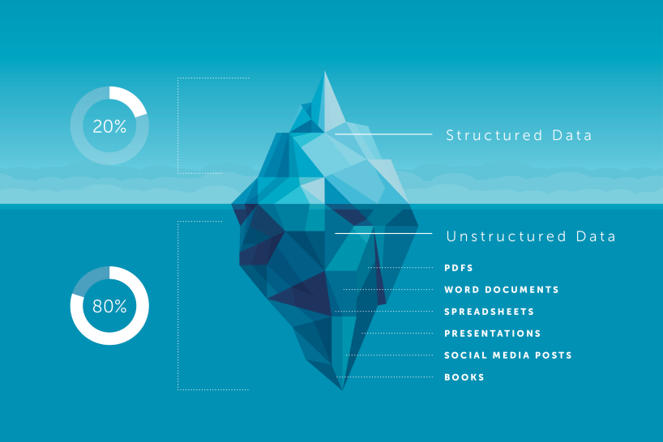

(Deep Data) أو البيانات الغير مهيكلة (Unstructured Data) هي نوع من البيانات الموجودة في علم البيانات و التي يرمز لها بالجزء المخفي من الجبل الجليدي كما يُشار إليه بالصورة التوضيحية أدناه.

{: .center-image}  
نجد أن نسبة٨٠ ٪ من البيانات مخفية في الجزء المظلم أو العميق والتي لا يسهل الوصول إليها وبطبيعة الحال يصعب تحليلها. من الأمثلة للبيانات الغير مهيكلة، المستندات بشتى أنواعها، الصور، الفيديوهات والتي تشمل منشورات وسائل التواصل الاجتماعي. بمعنى آخر، هي البيانات التي يصعب هيكلتها إلى صفوف وأعمدة. لذلك نجد أن لدينا كم هائل من المعلومات ولكن قليل منها ما يمكن الاستفادة منه وتحليله.  

> حالنا يقول: نتحدث عن البيانات الضخمة، وفي الواقع نكافح من أجل الحصول على بيانات صغيرة!
> د. حمود الدوسري{: .center-text}

البيانات الغير مهيكلة تتشكل أثناء قيام المنظمة بأعمالها اليومية، ولكن كيف يمكن أن تساعد في إثراء مخزون البيانات الذي يساهم في اتخاذ القرارات؟  

تحتاج المنظمات إلى تخزين هذه البيانات من مختلف المصادر المتاحة لديها، ومن ثم تحليلها ودراستها (Deep learning) ، ومشاركها مع صُناع القرار في المنظمة والذين بدورهم يمكنهم الاستفادة من كمية البيانات الضخمة هذه والازدهار باتخاذ القرارات وإدارة أعمال المنظمة.  

يوجد أيضا ما يسمى بالبيانات الشبه مهيكلة (semi structured) وهي تقريبا مشابهة للبيانات الرقمية. فعلى سبيل المثال، الصورة الملتقطة بالهاتف الذكي والتي بحد ذاتها نعتبرها غير مهيكلة (Unstructured) نجدها تحتوي على بعض البيانات المهيكلة مثل وقت التقاط الصورة، مكانها، أو رقم الجهاز الذي تم التقاطها به.  

لذلك عزيزي القارئ من المهم قبل البدء بتحليل بياناتك أن تحرص على تحديد نوعها ومن ثم تحديد الأدوات التي سوف تساهم في عملية التحليل.