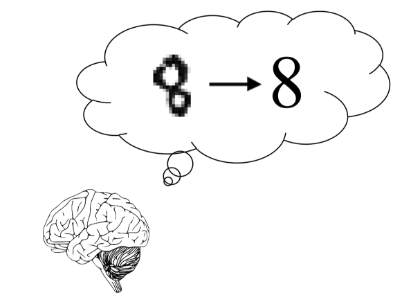

هل خطوت خطوتك الأولى في مجال التعلم العميق و تود استكشاف امكانيات الشبكات العصبية؟ هذا المقال سيستعرض كيفية بناء شبكة عصبية تُمَيز الصور في ثلاث خطوات بسيطة.  

إذا  أردت  أن  توصل  فكرة  معينه  فقم  بالتركيز  عليها  وهذا  ما يقوم  به "مظللي  البيانات" بحيث  يبدؤون محور الرسم  البياني  من  نقطة  كبيره  وقريبه  للنتائج  المعروضة  وبالتالي  يظهر أن هناك تباين كبير بين النتائج وهذا من أكثر أنواع التظليل شيوعاً. لذلك  تأكد  دائما  بأنه  لا  يمكن  ان  تبدأ محاور الرسم  البياني إلا  من  نقطة  الصفر.  

{: .center-image}

عند رؤية هذه الصورة لا يرى الدماغ البشري أي عائق للتعرف عليها على أنها رقم ثمانية. كتابة برنامج يمكن الآلات من تنفيذ مثل عمليات معالجة الدماغ البشري وإعطاء استنتاج مشابه لن يكون سهلاً. لكن في مجال التعلم العميق أبهرنا المبرمجون من كتابة برمجيات تعلم الآلة التي مكنت الحاسب على تنفيذ مثل هذه العمليات.  

## ما الفرق بين تعلم الآلة والتعلم العميق؟

التعلم العميق يركز على فئة من تعلم الآلة مستوحاة من عمليات الدماغ البشري وتسمى بالشبكات العصبية. تتكون الشبكات العصبية من خلايا عصبية تستقبل إشارات من خلايا أخرى لتنقلها وفي نهاية المطاف تكون اشارة تمثل التنبؤ الصحيح. لتمثيل هذه الشبكات العصبية نستخدم نظرية الرسم البياني، الشبكة تصبح سلسة طبقات من العقد المتصلة. كل عقدة في طبقة لديها حافة متصلة بعقدة الطبقة التالية ولكل حافة وزن مختلف، هذا الوزن هو رقم يرمز للاتصال بين العقد ويقيس أهمية هذا الاتصال. الشبكات العصبية تتكون من ثلاث أنواع أساسية من الطبقات: 
- طبقة داخلية.
- طبقة خارجية.
- طبقات مخفية.  
  
ويمكن اعتبار مجموعة من الطبقات "دماغ".

## ما هي الطبقات؟

- الطبقة الداخلية تتكون من أعصاب مدخلة وتحمل البيانات المبدئية التي تعالجها الطبقة المخفية.
- الطبقة المخفية هي طبقة بين الطبقة الداخلية والطبقة الخارجية ومهمتها الرئيسية هي إجراء الحسابات على المدخلات للحصول على مخرجات. يعتمد عدد الطبقات المخفية في الشبكة العصبية على حجم المسألة. في العادة يمكن إجراء مهام بسيطة باستخدام طبقة أو طبقتين، أما في الأمور المعقدة مثل استخدامها للتعرف على الوجوه قد تحتاج أكثر من ذلك بكثير!
- الطبقة الخارجية آخر طبقة في الشبكة العصبية وهي تنتج مخرجات البرنامج.


{: .center-image}

# الخطوة الأولى: تعرف على بياناتك

في هذا المقال سوف نتعرف على كيفية بناء شبكة عصبية بسيطة باستخدام بايثون ومكتبة keras. هدف البرنامج هو ادخال صور لأرقام مكتوب بخط اليد وتصنيفها كأعداد. مجموعة البيانات المستخدمة تحتوي على 60000 مجموعة تدريب و10000 مجموعة اختبار.


في الكود سوف نقوم بإستعراض بعض القيم الثابتة:
- Batch Size: حجم الحزمة، أي عدد الصور التي تقوم بتحليلها في آن واحد.
- epchos: عدد المرات التي ستمر بها مجموعة البيانات عبر الشبكة العصبية.

## الآن لنبدأ بتحميل البيانات

لنبدأ بتجهيز البيانات، وهي اهم خطوة في تحليل البيانات.

```python
from keras.datasets import mnist

(x_train, y_train), (x_test, y_test) = mnist.load_data()
```
- المتغيرات x_trains , x_test تحتوي على رموز ال RGB الرمادية.
- المتغيرات y_train, y_test تحتوي على مسميات من 0 الى 9 التي تعبر عن الرقم المرموز له بالصور.


لنبدأ باستكشاف مجموعة البيانات الكبيرة MNIST ونستعرض جزء من هذه المجموعة باستخدام مكتبة matplotlib:

```python
import matplotlib.pyplot as plt

figure = plt.figure()
num_of_images = 100
image = randint(0, 55000)

for index in range(1, num_of_images + 1):
    plt.subplot(10, 10, index)
    plt.axis('off')
    plt.imshow(x_train[image], cmap=plt.get_cmap('gray_r'))
```

{: .center-image}

نحتاج معرفة شكل وحجم البيانات، وحتى نستنتج ذلك نستخدم .shape من مكتبة numpy:

ستظهر لنا النتيجة (60000,28,28) ولنتذكر أن مجموعة البيانات تحتوي على 60000 صورة في مجموعة التدريب و (28,28) هو مقاسات الصور في البيكسل. في هذا المقال نود استعراض شبكة عصبية متصلة بالكامل، ونحتاج أن تكون بياناتنا على شكل متّجهات. إذاً عوضاً عن الصور في مقاس 28×28 بيكسل سوف نحتاج لجعلها كعدة متجهات. سنحتاج لإنشاء 784 عصب ( 28*28 )، كيراس يسمح لنا بإعداد متجه للصوره بهذا الشكل باستخدام الكود التالي:  

```python
vector = 784

x_train = x_train.reshape(60000, vector)
x_test = x_test.reshape(10000, vector)
```
الآن نحتاج لتصنيف النتائج (Labels). البيانات لدينا كمجموعة أرقام من 0-9 لكن لا نريد أن نتعامل معهم كأعداد صحيحة ولكن كعناصر. ولأننا نريد معرفة كل صورة ترمز لأي رقم، لا نحتاجها كأرقام صحيحة، لحل هذه المشكلة سوف نقوم بإعداد متجه وتعيين القيمة ١ عند موضع المسمى والبقية الى ٠.  
مثال:مسمى ٥ يتحول الى [0., 0., 0., 0., 0., 1., 0., 0., 0., 0.]  
والان الى الكود:

```python
num_classes = 10

y_train = keras.utils.to_categorical(y_train, num_classes)
y_test = keras.utils.to_categorical(y_test, num_classes)
```

# الخطوة الثانية: بناء النموذج

لبناء النموذج سوف نستعين بواجهة كيراس (Kersd API) تستخدم Tensorflow. 
لنبدأ بالبناء:

```python
from keras.models import Sequential

model = Sequential()
model.add(Dense(784, activation='relu', input_shape=(vector,)))
model.add(Dense(32, activation='relu'))
model.add(Dense(10, activation='softmax'))
model.summary()
model.compile(loss='categorical_crossentropy', optimizer='sgd', metrics=['accuracy']) 
# compile model with training parameters
```

بعد تحديد النموذج سنستخدم خاصية التقييم الخاصة به. عادة تسمى هذه الخاصية دالة الخسارة، تقوم هذه الدالة بإعلامنا ما إذا كان النموذج جيد او سيء. تمكننا هذه الدالة من تحسين وتطوير النموذج الذي نعمل عليه باستخدام خوارزمية التحسين.  
طبقنا دالة الخسارة الشهيرة ( categorical cross entropy ) و خوارزمية التحسين ( Stochastic Gradient Descent ).  

طبقات الشبكة العصبية:
- الطبقة الداخلية كمتجه مع 784 مدخل، والتي تتوافق مع 784 عقدة في هذه الطبقة.
- الطبقة الخارجية كمتجه مع 10 مسميات، والي تتوافق مع ال10 عقد في هذه الطبقة. في هذه الطبقة نستخدم خاصية ال softmax بحيث تقوم بتطبيع القيم المدخلة من الطبقة الداخلية حتى تكون جميع القيم بين ال 0-1 ومجموع ال10 قيم يساوي 1 ويتم التعامل مع هذه القيم كاحتمالات والاحتمال الأكبر يكون هو التوقع النهائي.
- طبقتان مخفيات مع 784 و32 عقد باستخدام ( relu activation function ).

# الخطوة الثالثة: تدريب وتقييم النموذج

### التدريب:
التدريب او بمعنى اخر إدخال البيانات الى الخوارزمية. عند تدريب شبكة عصبية، بيانات التدريب تدخل الطبقة الداخلية والعقد تقوم بإعطاء وزن لكل مدخل. وعند اخطار الشبكة العصبية من قبل الخوارزمية بأن الوزن خاطئ وتفعل ذلك بدون اخبارها ما هو الوزن الصحيح، فتقوم العقد بإعطاء تخمين اخر، حتى تصل الى التوقع الصحيح.  

### التقييم:
نستطيع استخدام مجموعة بيانات التحقق لتقدير ما إذا كان نموذجنا جيد أو سيئ، نقوم بتكرار التدريب لعدد محدد في قيمة epochs.

```python
batch_size = 500
epochs = 20

history = model.fit(x_train, y_train, batch_size=batch_size, epochs=epochs, validation_split=.1)
test_loss, test_acc = model.evaluate(x_test, y_test)
```

سنتعرض دقة النموذج الذي أعددناه ونقوم بتصويره:

```python
plt.plot(history.history['acc'])
plt.plot(history.history['val_acc'])
plt.title('model accuracy')
plt.ylabel('accuracy')
plt.xlabel('epoch')
plt.legend(['training', 'validation'], loc='best')
plt.show()
```

{: .center-image}

كما نرى فإن الدقة التي تم الحصول عليها تصل حوالي 95-98٪ وهي نتيجة مذهلة! ما يقرب من عشر مرات أفضل من التخمين بشكل عشوائي. رائع! هنا يمكنك رؤية القيم المتوقعة والمتلقاة:  

{: .center-image}

```python
def display_output(num, x_train, y_train):
    x_train_ex = x_train[num, :].reshape(1, 784) # one training  example image
    y_train_ex = y_train[num, :]
    label = y_train_ex.argmax() # get labels as integer
    prediction = int(model.predict_classes(x_train_ex)) # get prediction as integer
    plt.title(f’Predicted: {prediction} Label: {label}’)
    plt.imshow(x_train_ex.reshape([28, 28]), cmap=plt.get_cmap(‘gray_r’))

figure = plt.figure()

for x in range(1, 10):
    plt.subplot(3, 3, x)
    plt.axis(‘off’)
    display_output(randint(0, 55000), x_train, y_train)

plt.show()
```

وهكذا في هذا المقال أعددنا شبكة عصبية تقوم بتسمية صور لأرقام مكتوبة بخط اليد، تعرفنا على مكتبة   keras ومجموعة البيانات MNSIT. واستعرضنا كيفية تحضير البيانات قبل المعالجة وتدريب الخوارزمية لإعداد الشبكة العصبية ومن ثم تقييم التوقعات لهذه الشبكة.  
بعد هذه التجربة، ما هي خطوتك القادمة في مجال التعلم العميق؟  
  
  
  
  
  
المصادر:
- Ługowska, M., 2019. A Must-Read Tutorial When You Are Starting Your Journey With Deep Learning. Medium. Available at: <https://blog.skygate.io/a-must-read-tutorial-when-you-are-starting-your-journey-with-deep-learning-5fa4da071510> [Accessed 15 June 2020].
- علوم عظيمة. 2020. التعلم المتعمق، الدرس الأول: ماهي الشبكات العصبونية الاصطناعية. [online] Available at: <https://www.greatsciences.com/236/altlm-almtmq-aldrs-alawl-mahy-alshbkat-alsbwnyt-alastnayt> [Accessed 16 June 2020].
