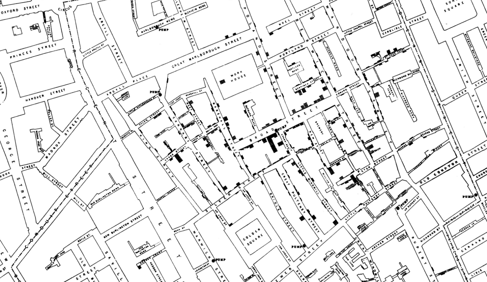

نحن ننتج البيانات بشكل ضخم وكبير يوميًا، فعندما تكتب تغريدة في تويتر او تلتقط صورة او ترسل رسالة نصية انت بفعلك هذا تقوم بخلق بيانات جديدة، تتدفق البيانات منا وحولنا في شتى جوانب حياتنا، جانب العمل، التعليم والصحة وغيرها.  

علم البيانات، يُستدل من اسمه انه من العلوم القائمة على البيانات وطرق التعامل معها ومعالجتها والاستفادة منها فيما يخدم البشرية ويُدلي بحلول للمشكلات التي تواجه بني البشر في جميع اوجه الحياة، البيانات اشبه بالثروة التي كلما تم الاعتناء بها والاستفادة منها بالشكل الصحيح تعود علينا بفوائد عديدة.  

علم تمثيل البيانات (Data Visualization) هو احدى العلوم المهمة والمتقاطعة مع علم البيانات والذي يُعنى بدوره بدراسة أنواع البيانات واختيار أفضل الطرق لتمثيلها بشكل رسومي/صوري/بياني وتمثيل العلاقات بينها.  

### فهل تساءلنا يومًا ما اهمية تمثيل البيانات؟ او لماذا نمثّل البيانات؟

تمثيل البيانات لا يقل اهمية عن البيانات بذاتها، التمثيل الصحيح للبيانات هو العصب الرئيس للاستفادة منها والتوصل الى قرارات من الصعب رؤيتها في صفوف واعمدة البيانات المجردة، قد تكون البيانات ذات قيمة عالية لكن بسبب التمثيل السيء لها لا تكون فاعلة في صنع قرار او استخلاص فائدة.  

تكمن اهمية تمثيل البيانات في اعطاء القارئ لها لمحة موجزة عن البيانات في ثوانٍ قليلة، ايضًا تمثيل البيانات يساعد في سهولة وسرعة عقد المقارنات. في المثال التالي نرى أن التعرف على اليوم الذي حصد اعلى مبيعات اسرع بالنظر الى التمثيل البياني مقارنةً بقراءة الجدول.  

{: .center-image}  

| اليوم   |      المبيعات      |
|----------|:-------------:|
| الاثنين |  23 |
| الثلاثاء |  27 |
| الاربعاء |  19 |
| الخميس |  24 |
| الجمعة |  32 |

في حديثنا عن تمثيل البيانات، نذكر مافعله الطبيب جون سنو، عام 1850 ميلادي عندما انتشرت الكوليرا في لندن، كان تفشيها لغزًا وكان الاعتقاد السائد هو انتشارها عن طريق الهواء، قام سنو باستخدام خريطة المدينة وقام بتمثيل كل حالة وفاة بشريط على الخريطة، كما بالصورة أسفل  

{: .center-image}  

لاحظ سنو تكتل معظم الحالات حول مضخة مياه في احدى الشوارع، كان هذا احدى خيوط المعرفة الأولية لتحديد مصدر انتشار الكوليرا، حيث استدل بذلك احتمالية كون المضخة هي مصدر الكوليرا، لاحقًا تم اغلاق المضخة وبدأ المرض بالانحسار وبالفعل كانت مضخة المياه ملوثه وكانت السبب وراء الكوليرا.  

في مثال آخر مع الممرضة البريطانية فلورنس نايتنجيل (Florence Nightingale) كان عملها في تمثيل البيانات ادى الى خفض نسبة الوفيات بين الجنود من 40% الى 2% وذلك عندما وصلت إلى المستشفى العسكري البريطاني في تركيا عام 1856، كان المشهد قاتمًا للغاية ومعدل الوفيات مرتفعًا، كان المستشفى فوضويًا - حتى لم يتم تسجيل عدد الوفيات بشكل صحيح- وكان يفتقر إلى الإمدادات الطبية.. في غضون ستة أشهر ، قامت نايتنجيل وفريقها المكون من 38 ممرضة بتحويل المستشفى وانخفض معدل الوفيات من 40 في المائة إلى 2 في المائة بسبب عملها. طوال الوقت كانت فلورنسا تسجل البيانات وقامت بتمثيلها بالشكل التالي حيث كل شريحة تمثل شهرا وحجم الشريحة يمثل عدد الوفيات ولونها يمثل سبب الوفاة   

{: .center-image}  

من التمثيل السابق علمت نايتنجيل أن الممارسات الصحية السيئة كانت السبب الرئيسي لارتفاع معدل الوفيات في المستشفيات العسكرية، حيث ان عدد الوفيات بسبب الامراض المعدية اكثر من عددها بسبب جروح المعارك.  

من خلال المثالين السابقين يظهر لنا كيف كان لتمثيل البيانات درو كبير في توجيه واتخاذ القرارات وإعطاء صورة أوضح للوضع الراهن، حيث ان اتخاذ القرارات بناءً على بيانات أفضل وأقل عواقب من اتخاذه بناءً على الحدس أو التخمين فقط.  

  
  
  
  
  
المصادر:
- [John Snow's data journalism: the cholera map that changed the world](https://www.theguardian.com/news/datablog/2013/mar/15/john-snow-cholera-map).
- [Florence Nightingale understood the power of visualizing science](https://www.sciencenews.org/article/florence-nightingale-birthday-power-visualizing-science).
- [Florence Nightingale: Data Visualization Pioneer](https://about.dataclassroom.com/blog/florence-nightingale).
