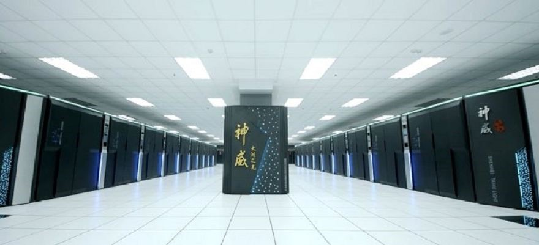
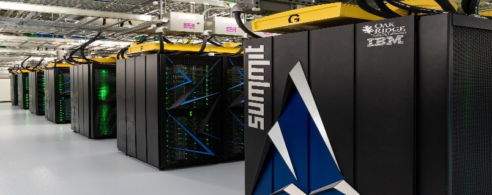
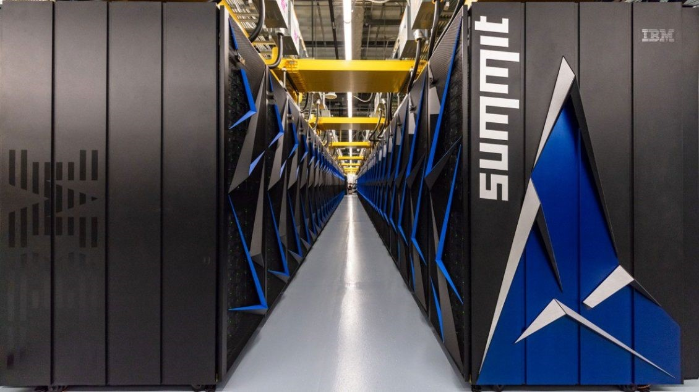

### ما أهمية البيانات في حياتنا؟

البيانات هي مجموعة من الحقائق التي ترجمت الى نموذج يمكن لأجهزة الكمبيوتر معالجته وقراءته. البيانات تعطي القدرة على إتخاذ قرارات أكثر دقه و فعالية، تعطي رؤية واضحة لمعرفة أسباب المشاكل التي نواجهها في المنظمات و العمل و المجتمعات ، أيضاً البيانات تسمح بقياس فعالية القرارات و الأستراتيجيات التي يتم تطبيقها في الشركات و المؤسسات و يحدد مكان الخلل إن وجد. فالبيانات تساهم بشكل كبير في تغير شكل العالم فهي جزء في كل الأشياء من حولنا. لكن عندما نريد أن نحصل على نتائج أكثر دقة و يعتمد و يقاس عليها نحتاج الى ما يسمى بالبيانات الضخمة.

و هذا ما يقودنا للسؤال التالي: 

### ماهي البيانات الضخمة؟

### متى نطلق على البيانات مصطلح "البيانات الضخمة"؟

لنعرف أولاً أنه لا يوجد حجم محدد للبيانات لتصبح ضخمة. يمثل مصطلح البيانات الضخمة الكمية المتزايدة و المتنوعة من البيانات التي يتم جمعها ، الكثير من المعلومات تنتقل عبر الإنترنت و تصبح رقمية هذه المعلومات تشكل البيانات الضخمة . لكن ليس حجم البيانات هو المهم، المهم كيف يمكننا تحليل هذه البيانات و الإستفادة منها و الحصول على رؤية تؤدي الى قرارات أفضل و تحركات إستراتيجية مدروسة. 

### هنا يأتي دور السوبر كمبيوتر

كل ما كان حجم البيانات عالي جداً هنا نحتاج الى ما يسمى ب " Supercomputer " حتى نتمكن من معالجة البيانات و تحليلها بشكل سريع و دقيق لابد أن نستخدم أجهزة الكمبيوتر فائقة السرعة. فهي تستطيع أن توصلنا لنتائج لا يمكن لنا الوصول لها بواسطة العقل البشري وحده.  
 كل ما كان حجم البيانات عالي جداً هنا نحتاج الى ما يسمى ب " Supercomputer " حتى نتمكن من معالجة البيانات و تحليلها بشكل سريع و دقيق لابد أن نستخدم أجهزة الكمبيوتر فائقة السرعة. فهي تستطيع أن توصلنا لنتائج لا يمكن لنا الوصول لها بواسطة العقل البشري وحده.
أجهزة الحاسب فائقة السرعة تختلف عن الأجهزة الحاسب العادية فهي لديها القدرة على إجراء عدد كبير من عمليات المحاكاة في وقت قصير بإستخدام بيانات ضخمة جداً و إستنتاج المعلومات من البيانات الضخمة التي تم تحليلها.  
فهي تمتلك قدرات عالية جداً تفوق أجهزة الحاسب التي نمتلكها ، أيضاً أحجامها كبيرة و عادة ما تكون مموله من قبل جهات حكومية.
 
{: .center-image}  

فأسرع حاسبين في العالم منتجة من قبل IBM و هي مملوكة لوزارة الطاقة الأمريكية و مختبر لورانس ليفرمور الوطني بكاليفورنيا.

 و الذي يحل في المرتبة الثالثة و الرابعة مملوك من قبل المركز الوطني الصيني للحوسبة الفائقة في ووشي
و قوانغتشو.

### أسرع جهاز سوبر كمبيوتر في العالم

{: .center-image}  

أسرع جهاز حاسب في العالم يدعى ساميت "Summit" صمتته شركة IBM تبلغ سرعته بمجموع سرعات مليون جهاز حاسب من الأنواع الأسرع عالمياً. بالأرقام ساميت يستطيع عمل 200 كوارديليون عملية حسابية في الثانية ، تبلغ سعة التخزين 250 بيتابايت ، يمتلك 9216 وحدات المعالجة المركزية "IBM POWER9 CPUs" 25 جيجا بايت في الثانية بين "nodes" ، 27648 "NVIDIA Tesla GPUs" ، بهذه القدرات سوف يقوم ساميت بدفع حدود الحوسبة و التفاهم البشري. فهو صُمم لمواجهة أكبر تحديات العالم. 
  
### تطبيقات علم البيانات عبر السوبر كمبيوتر

أحد التحديات التي تواجة العالم هو مرض السرطان. ستساعد خوارزميات التعلم الآلي "machine learning" التي تم تحجيمها و جمعها في ساميت على تزويد الباحثين الطبيين برؤية شاملة لمرضى السرطان في الولايات المتحدة على مستوى عالي جداً من التفاصيل لا يمكن الحصول عليه الا عن طريق تجارب سريرية موسعة.  
أيضاً أحد التحديات الأخرى التي تواجه العالم هي تحديد موارد الطاقة للجيل القادم . التعلم العميق "Deep learning" المتوفر في ساميت يمكنه مساعدة العلماء من خلال تدريب الخوارزميات على التنبؤ بخصائص المواد ، و على إجابة أسئلة في المستقبل حول سلوكيات المواد على المقاييس الذرية .

### أمثلة على تجارب قام بها جهاز ساميت: 

- أنه تمكن من تحديد تغيرات في الخلايا تسبق مرض الزهايمر.
- تمكن من التنبؤ ببعض العواصف و الأعاصير القوية عن طريق المحاكاة الدقيقة.

  
### السوبر كمبيوتر في وقتنا الحالي
### هل ساعد جهاز ساميت على إكتشاف علاج لفايروس الكورونا المستجد؟

لقد قام جهاز ساميت بتحليل ثمانية آلاف مركب كميائي و كيفية تفاعلها مع الخلايا و الفايروسات و قام بتحديد 77 مركب لها تأثير إيجابي في ايقاف خطر الفيروس و تم نشر هذا التحليل في ورقة علمية.  
اتخذت من ساميت مثال لانه يعد الأعلى سرعة و قوة و ذكاء على مستوى جميع أجهزة السوبر كمبيوتر في العالم. و هو يحتل المرتبة الأولى منذ عام 2018. 

{: .center-image}  

### أسرع عشرة كمبيوترات فائقة السرعة في العالم بناءاً على اخر إحصائية

| المرتبة     | اليوم   |      المبيعات      |
|:------:|:----------:|:-------------:|
|1| SUMMIT | وزارة الطاقة الأمركية |
|2| SIERRA | مختبر لورانس ليفرمور الوطني بكاليفورنيا |
|3| SUNWAY TAIHULIGHT | المركز الوطني الصيني للحوسبة الفائقة (ووشي ، الصين) |
|4| TIANHE-2A | المركز الوطني الصيني للحوسبة الفائقة (قوانغتشو ، الصين) |
|5| FRONTIER | مركز الحوسبة المتقدمة في تكساس ، جامعة تكساس (الولايات المتحدة الأمريكية) |
|6| PIZ DAINT | المركز الوطني السويسري للحوسبة الفائقة |
|7| TRINITY | مختبر لوس ألاموس الوطني (الولايات المتحدة الأمريكية) |
|8| AI BRIDGING CLOUD INFRASTRUCTURE (ABCI) | المعهد الوطني للعلوم الصناعية المتقدمة والتكنولوجيا (اليابان) |
|9| SUPERMUC-NG | مركز بيانات ليبنيز (ألمانيا) |
|10| LASSEN | مختبر لورانس ليفرمور الوطني (الولايات المتحدة الأمريكية) |

المصادر:
- [أسرع عشرة كمبيوترات فائقة السرعة في العالم](https://www.bbvaopenmind.com/en/technology/innovation/the-top-10-supercomputers-the-new-scientific-giants/).
- [مساهمة ساميت في علاج فايروس الكورونا المستجد](https://www.shorouknews.com/columns/view.aspx?cdate=28032020&id=1b2face4-bf34-4ea4-99df-bea3bea306c0).
- [معلومات عن ساميت](https://www.ibm.com/thought-leadership/summit-supercomputer/ ).
